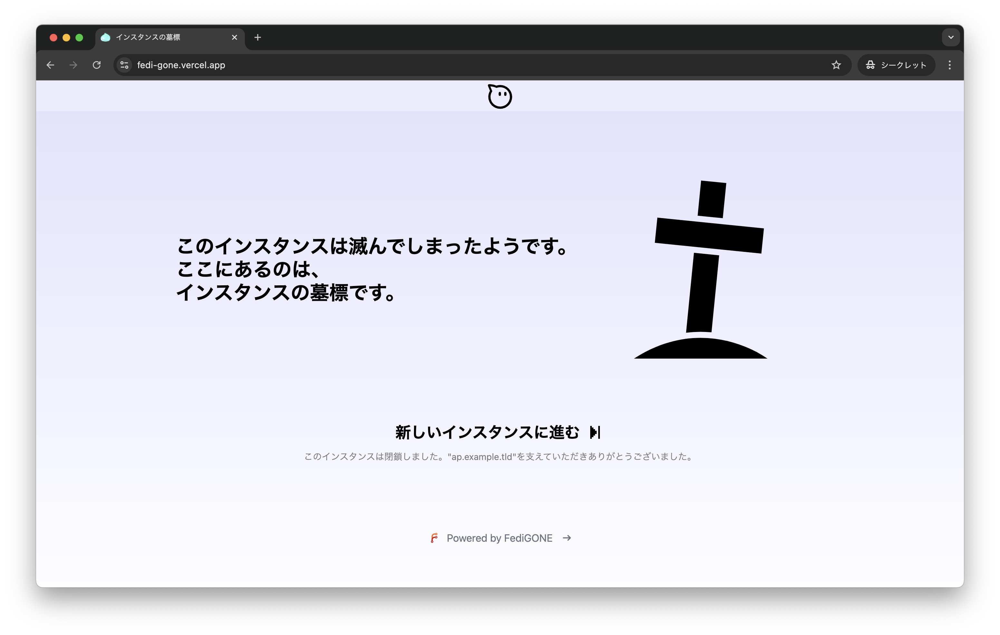

<div align="center">

# †| FediGONE |†


## What is this?

A "410 Gone" frontend page for a Federated SNS. [View Demo Page](https://fedi-gone.vercel.app/)

</div>

<details>
<summary>View Screenshots</summary>



</details>

## Usage 💨

You need to write `src/consts.ts` according to your instance information.

> [!WARNING]
> You shouldn't edit `dist/vercel.json`. If you changed this file, your activity pub server can't be return 410 GONE.

```bash
git clone https://git.v-sli.me/HidemaruOwO/FediGONE.git
cd FediGONE

# edit src/consts.ts for your AP instance
vim src/consts.ts

# export static HTML files
bun run install
bun run build

# deploy FediGONE on vercel
cd dist
vercel deploy --prod
```

<details>
<summary>View default src/consts.ts</summary>

```ts
export const DOMAIN = "ap.example.tld";
export const TITLE = "インスタンスの墓標";
export const DESCRIPTION = `このインスタンスは閉鎖しました。"${DOMAIN}"を支えていただきありがとうございました。`;
export const MAIN_MESSAGE_LINE: string[] = [
	`このインスタンスは滅んでしまったようです。`,
	`ここにあるのは、`,
	`インスタンスの墓標です。`,
];
export const NEXT_INSTANCE_URL = "https://new.example.tld";
export const NEXT_INSTANCE_MESSAGE = "新しいインスタンスに進む";
```

</details>

## Dependencies 🪡

requirements `bun` or `nodejs` for build astro project.

- `bun`
- `nodejs`

## Reference ✨

- [HidemaruOwO/Awesome-README](https://git.v-sli.me/HidemaruOwO/Awesome-README)

